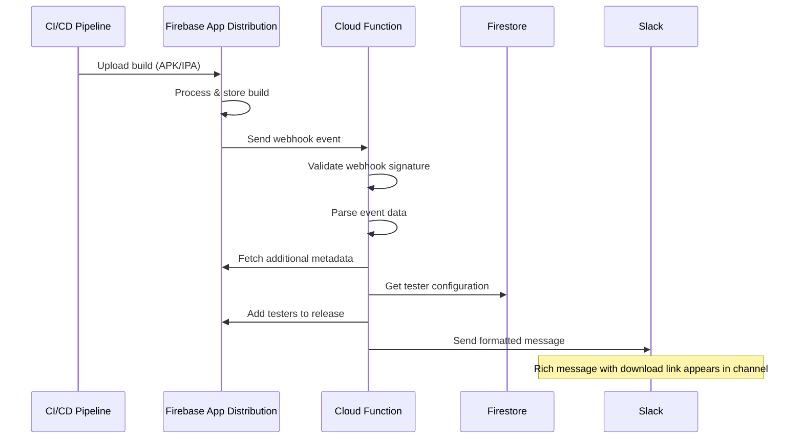
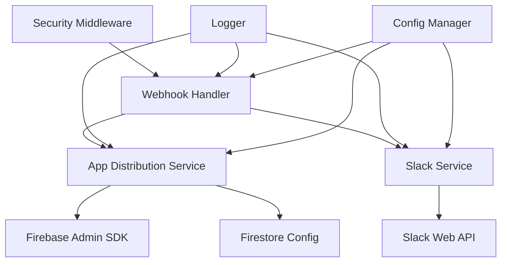
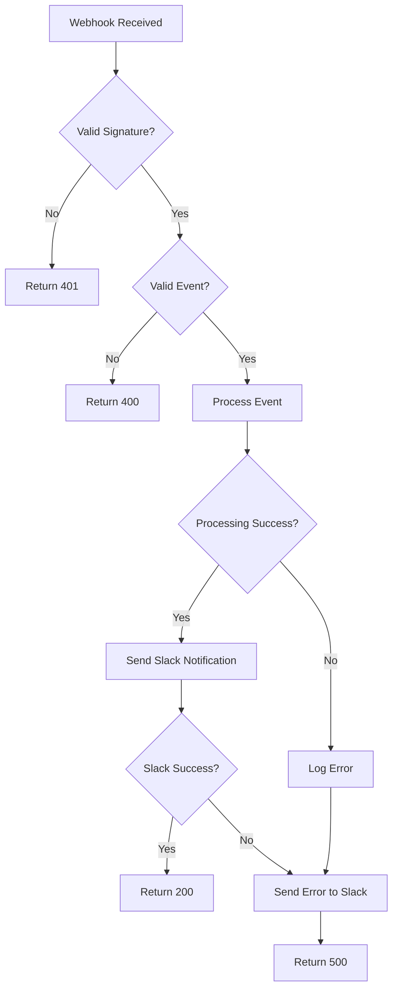

# Architecture & Flow Diagram

## System Architecture

```
┌─────────────────┐    ┌─────────────────┐    ┌─────────────────┐
│                 │    │                 │    │                 │
│   CI/CD Pipeline│    │    Firebase     │    │   Cloud         │
│   (Build Apps)  │───▶│ App Distribution│───▶│   Function      │
│                 │    │                 │    │   (Webhook)     │
└─────────────────┘    └─────────────────┘    └─────────────────┘
                                                        │
┌─────────────────┐    ┌─────────────────┐            │
│                 │    │                 │            │
│   Slack API     │◀───│   Slack Bot     │◀───────────┘
│   (Messages)    │    │   Service       │
│                 │    │                 │
└─────────────────┘    └─────────────────┘
                                │
┌─────────────────┐    ┌─────────────────┐
│                 │    │                 │
│   Firestore     │◀───│   Tester        │
│   (Config)      │    │   Management    │
│                 │    │                 │
└─────────────────┘    └─────────────────┘
```

## Data Flow

### 1. Build Upload Flow



### 2. Component Interaction



## Event Processing Pipeline

### Input: Firebase App Distribution Webhook

```json
{
  "eventType": "appDistribution.release.created",
  "data": {
    "release": {
      "releaseId": "abc123",
      "displayVersion": "1.0.0",
      "buildVersion": "456",
      "createTime": "2024-01-01T12:00:00Z",
      "releaseNotes": { "text": "Bug fixes" },
      "downloadUrl": "https://appdistribution.firebase.dev/i/abc123"
    },
    "app": {
      "displayName": "My App",
      "platform": "android",
      "packageName": "com.example.app"
    }
  }
}
```

### Processing Steps

1. **Webhook Validation**
   - Signature verification
   - Timestamp validation
   - Rate limiting

2. **Event Processing**
   - Extract build metadata
   - Fetch download URL (if not provided)
   - Get tester configuration

3. **Tester Management**
   - Query Firestore for tester groups
   - Add testers to release
   - Handle permission errors

4. **Slack Notification**
   - Format rich message
   - Include platform-specific instructions
   - Send to configured channel

### Output: Slack Message

```json
{
  "channel": "#app-releases",
  "text": "New ANDROID build: My App 1.0.0",
  "blocks": [
    {
      "type": "header",
      "text": {
        "type": "plain_text",
        "text": "🤖 New ANDROID Build Available"
      }
    },
    {
      "type": "section",
      "fields": [
        {"type": "mrkdwn", "text": "*App:* My App"},
        {"type": "mrkdwn", "text": "*Version:* 1.0.0 (456)"}
      ]
    }
  ]
}
```

## Error Handling Flow



## Security Architecture

### Authentication & Authorization

```
┌─────────────────────────────────────────────────────────┐
│                    Security Layers                      │
├─────────────────────────────────────────────────────────┤
│ 1. Webhook Signature Verification                      │
│    - Firebase webhook signature                        │
│    - Timestamp validation (prevent replay)             │
├─────────────────────────────────────────────────────────┤
│ 2. Rate Limiting                                       │
│    - Per-IP rate limiting                              │
│    - Configurable limits                               │
├─────────────────────────────────────────────────────────┤
│ 3. Input Validation                                    │
│    - JSON schema validation                            │
│    - Sanitize user inputs                              │
├─────────────────────────────────────────────────────────┤
│ 4. Secure Token Storage                                │
│    - Firebase Functions Config                         │
│    - Environment variables                             │
├─────────────────────────────────────────────────────────┤
│ 5. CORS & Security Headers                             │
│    - Helmet.js security headers                       │
│    - CORS configuration                                │
└─────────────────────────────────────────────────────────┘
```

## Scalability Considerations

### Horizontal Scaling
- **Cloud Functions**: Auto-scaling based on demand
- **Concurrent Requests**: Handle multiple webhooks simultaneously
- **Rate Limiting**: Prevent abuse and ensure stability

### Performance Optimization
- **Connection Pooling**: Reuse Slack API connections
- **Caching**: Cache tester configurations
- **Async Processing**: Non-blocking operations where possible

### Monitoring & Logging
- **Structured Logging**: JSON format with context
- **Error Tracking**: Comprehensive error handling
- **Metrics**: Response times, success rates, error rates

## Configuration Management

```
environments.ts
├── Development
│   ├── Debug logging
│   ├── Relaxed security
│   └── Test channels
├── Staging
│   ├── Production-like setup
│   ├── Staging channels
│   └── Full security
└── Production
    ├── Minimal logging
    ├── Full security
    └── Production channels
```

## Future Enhancements

### Planned Features

1. **Advanced Notifications**
   - Build comparison reports
   - Crash analytics integration
   - Performance metrics

2. **Enhanced Slack Integration**
   - Slash commands
   - Interactive dialogs
   - Thread-based conversations

3. **Multi-Platform Support**
   - Support for other platforms
   - Cross-platform build comparison
   - Unified reporting

4. **Analytics & Reporting**
   - Build frequency analytics
   - Tester engagement metrics
   - Download statistics

### Integration Points

- **Jira/Linear**: Link releases to tickets
- **GitHub/GitLab**: Connect to commits/PRs
- **TestFlight**: iOS App Store Connect integration
- **Google Play**: Android internal testing integration
